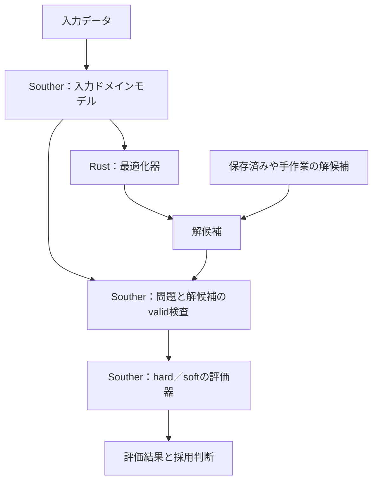

# Southerによる最適化の入出力ドメインモデルの試作

最適化問題の入力と解候補をSoutherのドメインモデルとして実装し、Rustで実装した最適化器と接続する試作です。
型による成立条件の検査、解候補の評価、求解結果の受け渡しを、実行可能なコードで確かめます。

現在は作業割当問題を題材に、入力モデル、解候補、評価結果、採用判断までを実装しています。
作業割当はこの構成を試すための一例であり、リポジトリの主題はSoutherと最適化器の責務をどう分けるかです。

## 試作で確かめること

- 入力データと解候補の意味を、Southerの型と成立条件で表す。
- valid／hard／softを分け、実行不可能な候補も保持して原因を調べられるようにする。
- Southerの評価器とRustの最適化器を独立させ、保存済みや手作業の候補も評価する。
- ソルバーの終了状態、候補の実行可能性、採用判断を別々に扱う。



図はデータの流れを表します。
評価器はソルバーを呼ばず、最適化器も評価器を呼びません。
Rustのアプリケーション層が両方を順に呼び出します。

## ドメインモデルと制約の責務

| 種類 | 意味 | 実装する場所 |
| --- | --- | --- |
| valid | 入力や解候補の意味を一意に解釈できるための条件 | Southerの型と `invariant`。生成またはデコード時に検査 |
| hard | 解候補が実行可能であるために満たすべき条件 | Southerの評価器。違反箇所と違反量を返す |
| soft | 解候補の望ましさを比較するための条件 | Southerの評価器。違反に対するペナルティを返す |

一つの条件はいずれか一種類に分類し、評価の定義はSoutherに集約します。
validを満たす候補は、hard違反があっても生成、保存、評価できます。
この区別によって、実行可能解がまだ得られない開発段階でも候補を調べられます。

Rustの最適化器は、候補を生成するための数理定式化を独立して持ちます。
評価器との式の共有や自動変換は行いません。
同じ業務要件を満たす定式化かどうかは、Southerの評価器と小問題の全列挙を使ったテストで確認します。

## 実装の構成

| ファイル | 担当 |
| --- | --- |
| `model/assignment.sou` | validの型、hard／soft評価、費用計算、採用判断、入出力と求解の契約 |
| `src/optimizer.rs` | 独立したMILP定式化、HiGHS、終了状態、数値変換 |
| `src/lib.rs` | 入出力のデコード、求解と評価の呼出し、結果の構成 |
| `src/main.rs` | CLI、ファイル入出力、終了コード |
| `tests/workflow.rs` | 評価器の単独実行、模擬ソルバー、全列挙、境界、CLI |

[日本語版モデル](model-ja/assignment.sou) は同じ規則を日本語の識別子で記述した参照版です。
Rustへの接続と `bin/build`、`bin/test` の対象には含めません。
日本語版もSouther単体でコンパイルを確認しています。
生成RustはSoutherの型を操作するための接続コードであり、MILPを生成するものではありません。

## 現在の題材：作業割当

作業者の稼働時間、担当資格、所要時間、費用を入力し、各作業の担当者を決める小規模な問題を使っています。
最適化器はRustの `good_lp` で混合整数線形計画（MILP）を構築し、HiGHSで求解します。
HiGHS本体はC++製です。

| 区分 | この題材で扱う条件 |
| --- | --- |
| valid | IDと組合せの一意性、参照先と所要時間や費用の定義が存在すること |
| hard | 全作業をちょうど1人に割り当てる、担当資格を満たす、残業上限を守る |
| soft | 望ましい残業時間を超えた分に分単価でペナルティを課す |

候補計画は割当の集合です。
同じ組合せの重複はvalid違反ですが、異なる作業者への同一作業の重複割当や未割当はhard違反です。
`CandidatePlan` は単体の形を検査し、問題と候補を組にした `EvaluationInput` の生成時に参照整合性を検査します。
存在しない組合せは所要時間と費用を解釈できないため、ここで拒否します。
担当不可の組合せでも評価できるよう、`Offer.qualified` と所要時間や費用は別の情報として持ちます。

評価器は最初の違反で止まらず、すべての違反について規則、対象、実測値、許容値、違反量を返します。
hard違反がある候補も通常の評価結果として保存できます。
負荷、残業、費用は評価器が計算するため、候補JSONには含めません。
費用は目的値の一部であり、値が大きいだけでvalidやhardの違反にはなりません。
残業承認は採用方針として評価後に扱い、hard違反を承認で上書きすることはできません。

## 環境構築

前提はPython 3、curl、tar、unzip、rustup、C/C++コンパイラー、libclangです。
macOSではXcode Command Line ToolsとLLVM、Ubuntuでは `build-essential clang libclang-dev unzip` を用意します。
libclangを検出できない場合は `LIBCLANG_PATH` にディレクトリーを指定してください。

```bash
bin/setup
bin/build
bin/test
```

`bin/setup` は固定したJDK 25.0.4.1、Maven 3.9.16、CMake 4.1.2を `.tools/` に取得し、SHA-256を検証します。
Rust 1.95.0はrustupで管理します。
Souther本体とnative compilerは固定コミットを `.deps/` に取得します。
初回はインターネット接続が必要です。
シェルの起動設定は変更しません。

`bin/build` は `model/assignment.sou` から共有ライブラリと `build/rust/` の接続コードを生成し、Rustをビルドします。
生成済みの `build/` は編集しません。
HiGHSもCargoの依存としてビルドし、静的リンクします。
macOSのApple Siliconで検証しています。
macOSのx86_64、Linuxのx86_64とaarch64用の設定もありますが、それらの環境での実行は未確認です。

## 作業割当の実行例

```bash
# 通常の求解。search、review、solverを返す
bin/run solve examples/regular.json
bin/run solve examples/overtime.json

# 最適化器を使わず、保存済みの候補を評価する
bin/run review examples/overtime.json examples/overtime-plan.json

# hard違反3件とsoftペナルティをまとめて返す（終了コード6）
bin/run review examples/diagnostic.json examples/diagnostic-plan.json

# soft制約を目的に含めると、残業を避ける割当が選ばれる
bin/run solve examples/soft.json

# 未承認なら承認待ち（終了コード5）、承認済みなら確定
bin/run confirm examples/overtime.json examples/overtime-plan.json
bin/run confirm examples/overtime.json examples/overtime-plan.json --approve-overtime

# 承認済みでも未割当のある計画は却下（終了コード6）
bin/run confirm examples/overtime.json examples/rejected-plan.json --approve-overtime
```

通常例と残業例の最適費用は60です。
`soft.json` に同じ残業計画を与えると、費用60、softペナルティ90、目的値150と評価されます。
この問題を求解すると、残業を避ける費用120、ペナルティ0の計画が選ばれます。

候補の保存と再評価は次のように行います。

```bash
bin/run solve examples/overtime.json > build/result.json
python3 -c 'import json; d=json.load(open("build/result.json")); print(json.dumps(d["search"]["plan"], indent=2))' > build/plan.json
bin/run review examples/overtime.json build/plan.json
```

`review` と `confirm` は `plan`、`evaluation`、`decision` を返します。
`evaluation` は `feasible`、`hardViolations`、`softPenalties`、`loads`、`totalCost`、`softPenalty`、`objectiveValue` を含みます。
hard違反が0件なら実行可能であり、softペナルティは実行可能性を変えません。
目的値は `totalCost + softPenalty` です。

`solve` の `search.type` はソルバーの状態を表します。
`OptimalCandidate` はソルバーが最適終了した候補、`StoppedWithCandidate` は打切り時点の候補です。
実行可能性の判断には、別の `review.evaluation.feasible` を使います。
`Infeasible` はソルバーが実行不能と判定した場合、`NoCandidate` は候補を得ずに終了した場合です。
候補がない場合の `review` は `null` です。
通常のMIP求解から実行不可能な診断候補を自動生成する機能はありません。
その場合も、手作業や別の探索方法で作った候補を `review` に渡して調査できます。

承認フラグはローカルで与える意思決定であり、本人認証、権限、監査記録、DBへの保存は実装していません。
確定時には、渡された現在の問題に対して必ず再評価します。

## 作業割当モデルの入出力

入力は `workers`、`jobs`、`offers` の配列です。
作業者は `id`、`regularMinutes`、`overtimeLimit`、`overtimeRate`、`overtimeTarget`、`overtimePenalty` を持ちます。
組合せは `workerId`、`jobId`、`minutes`、`cost`、`qualified` を持ちます。
候補は `{"assignments": [{"workerId": "alice", "jobId": "job1"}]}` の形式です。

| 値 | サンプルで扱う範囲 |
| --- | --- |
| ID | 英字で始まる英数字、`_`、`-`、最大64文字 |
| 作業者数、作業数、組合せ数 | 最大16、32、512 |
| 通常稼働、残業上限、残業の目安 | 各0〜1440分 |
| 所要時間 | 1〜1440分 |
| 割当費用 | 0〜1,000,000、整数の最小通貨単位 |
| 残業費用とsoftペナルティの分単価 | 1〜10,000 |

これらの上限は、サンプルの入力規模と厳密な整数計算の範囲を定めるものです。
候補の負荷を残業上限以内に制限するものではありません。
全512組を選ぶ実行不可能な候補も評価でき、費用約79億、目的値約153億までの境界例をテストしています。
時刻、作業順序、作業の分割は扱いません。

### CLIの終了コード

| 終了コード | 意味 |
| --- | --- |
| 0 | 求解は最適終了かつ評価上実行可能。単独評価は確定可能、確定操作は確定済み |
| 1 | ファイル、ライブラリ、ソルバー、数値変換などの技術エラー |
| 2 | 入力問題または候補のvalid違反。評価前に拒否 |
| 3 | ソルバーが実行不能と判定 |
| 4 | 候補の有無によらず探索打切り。ただし候補のhard違反があれば6 |
| 5 | 単独評価または確定操作で残業承認待ち |
| 6 | 候補にhard違反あり。候補と評価結果を標準出力へ返す |

`solve` の終了コード0でも残業承認は完了していません。
`review.decision` を確認してください。
valid違反は標準出力の `issues`、技術エラーは標準エラー出力の `technical_error` で返します。
ソルバー実装がvalid違反の候補を生成した場合は、生成契約の違反として技術エラーになります。

## 作業割当の定式化

Rustは担当可能な組合せを選ぶ二値変数 `x`、残業分数 `o`、望ましい残業からの超過 `s` を使います。
担当不可の組合せの `x` は0に固定します。

```text
min Σ cost[w,j] x[w,j] + Σ overtimeRate[w] o[w] + Σ overtimePenalty[w] s[w]
s.t. Σ(w) x[w,j] = 1
     Σ(j) minutes[w,j] x[w,j] ≤ regularMinutes[w] + o[w]
     0 ≤ o[w] ≤ overtimeLimit[w]
     s[w] ≥ o[w] - overtimeTarget[w], s[w] ≥ 0
```

残業と超過の単価が正なので、最適解では余分な値が残りません。
候補として渡すのは割当だけです。
Southerが実際に必要な残業と費用を計算するため、打切り時のソルバー内部の余分な残業や超過は引き継ぎません。
`solver.incumbentObjective`、`bestBound`、`relativeGap` はソルバーの定式化に対する値であり、評価器の目的値に読み替えません。
最適性は数値ソルバーの判断で、数学的な厳密証明ではありません。

## 検証と配布

`bin/test` はモデルを再生成し、書式、Clippy、Rustのテストを実行します。
Southerの実行例2件はモデルの生成時に検査します。
Rustの19テストには、独立した全列挙による80問題の目的値照合を含みます。
業務上のhard違反と生成契約違反、ソルバーの主張と評価結果を区別するテストもあります。

```bash
bin/package
./dist/souther-rust-mathopt solve examples/regular.json
```

配布物は同じOSとCPU向けです。
実行ファイルと隣接する `lib/` を一緒に移動してください。
実行時にJava、Maven、Cargoは不要ですが、OSのC/C++ランタイムは必要です。
固定版とライセンスは [THIRD_PARTY.md](THIRD_PARTY.md)、環境の版とハッシュは [toolchain.lock.json](toolchain.lock.json)、Rust依存は [Cargo.lock](Cargo.lock) に記録しています。
